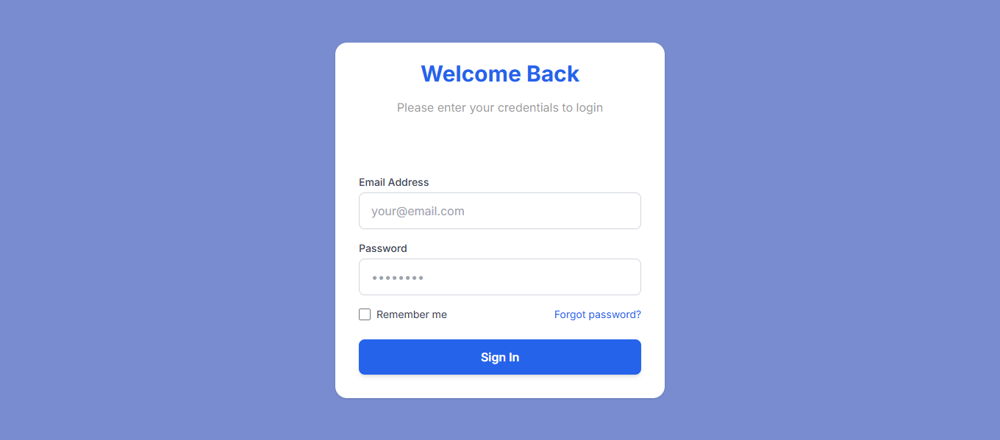
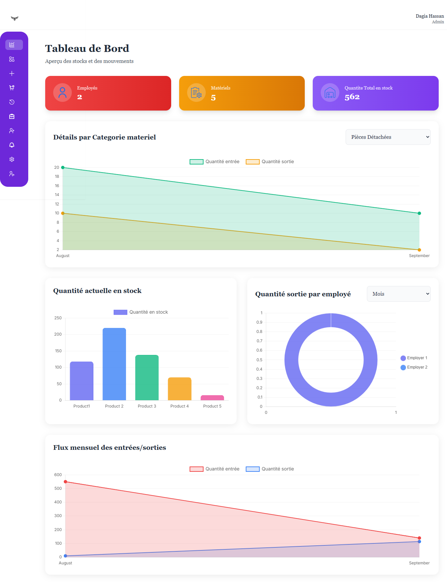
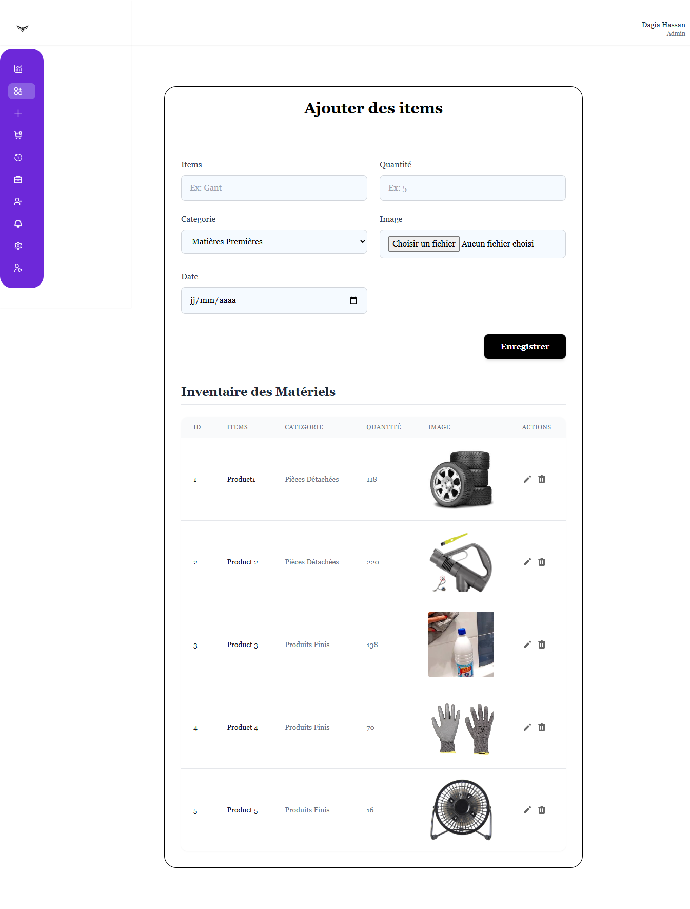
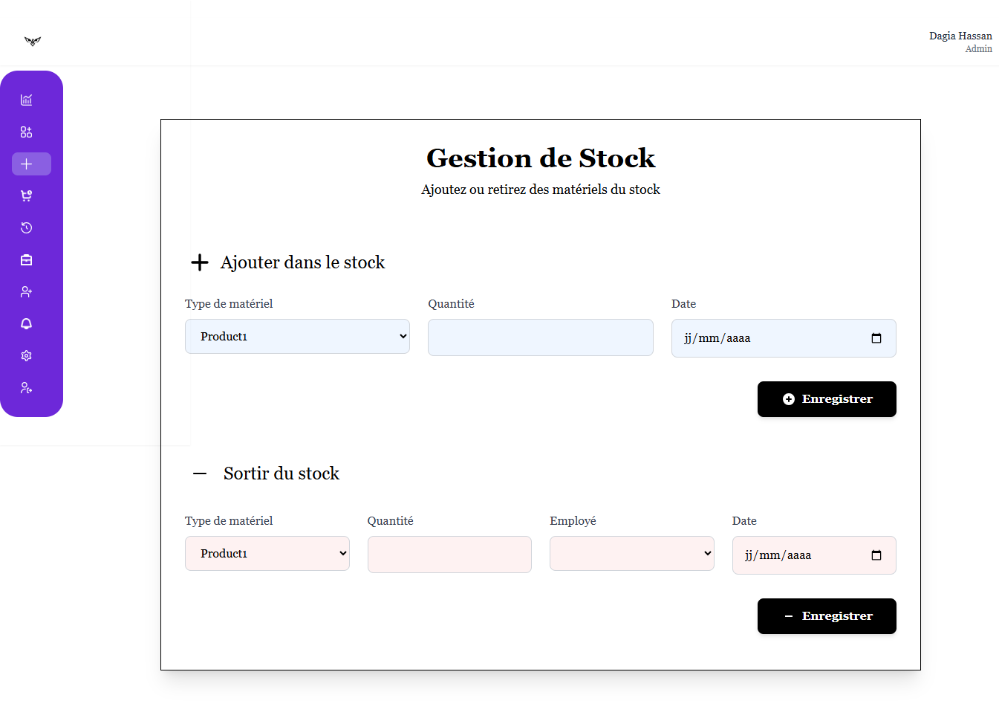
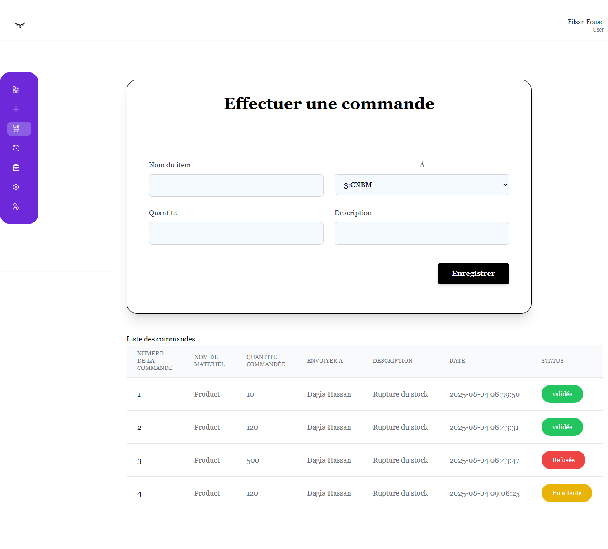
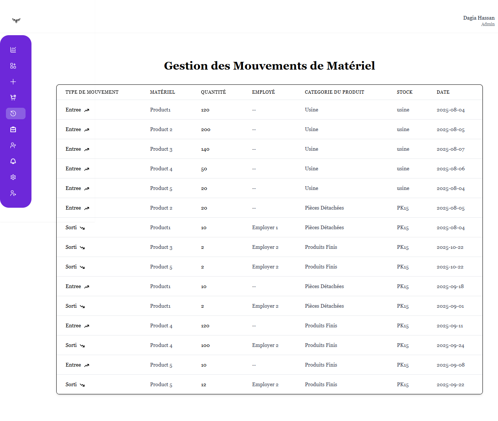
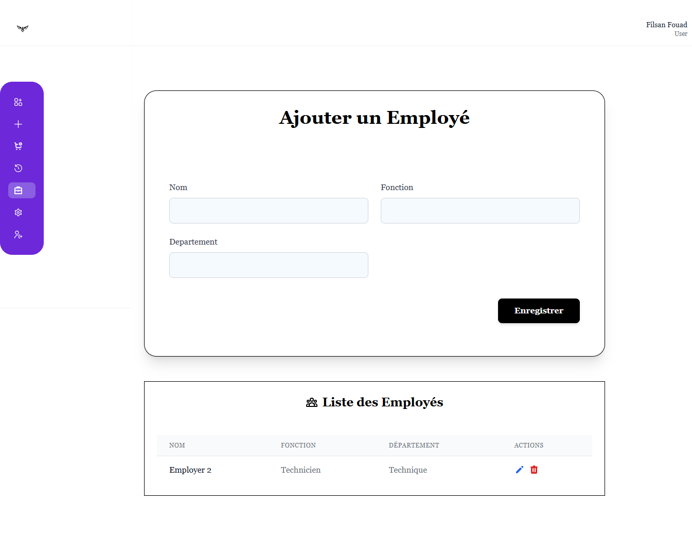
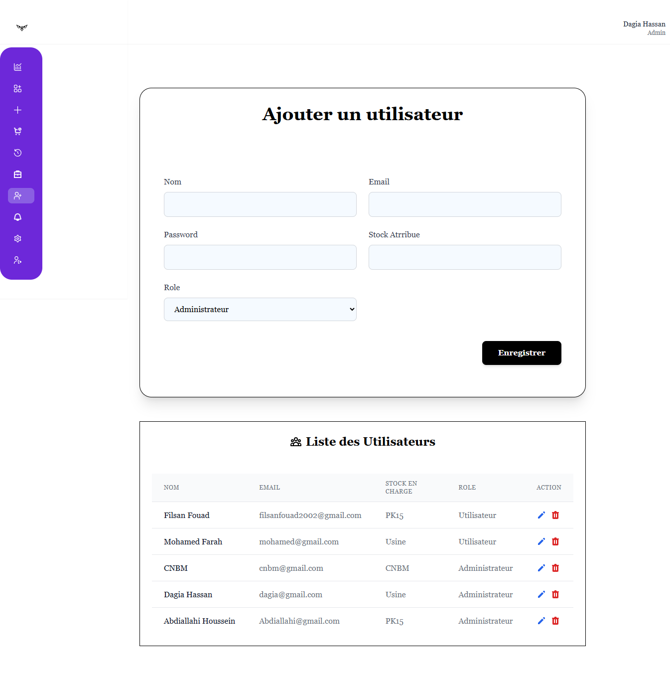
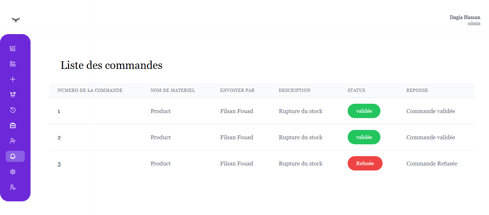

# 📦 StockApp

**StockApp** est une application de gestion de stock intuitive développée avec Laravel. Elle permet de gérer efficacement le matériel informatique au sein d'une organisation.

---

## 🚀 Fonctionnalités principales

- 🧾 Enregistrement de nouveaux matériels (nom, quantité, image, catégorie…)
- 🗃️ Gestion des catégories de matériels
- 📊 Tableau de bord avec résumé des équipements
- 🔍 Recherche de matériel par nom ou catégorie
- 🖼️ Ajout d'image pour chaque matériel
- 📝 Formulaires simples et épurés avec Tailwind CSS

---

## 🛠️ Technologies utilisées

- ⚙️ **Laravel 10**
- 🎨 **Tailwind CSS**
- 🗃️ **MySQL** (ou MariaDB)
- 🌐 **Blade** (moteur de templates Laravel)
- 🖼️ **HTML/CSS**
- 🛡️ Authentification Laravel (à ajouter pour la production)

---

## 🔍 Vue d'ensemble détaillée du fonctionnement de l'application

### 🔐 Page de connexion  
Interface de connexion sécurisée permettant uniquement aux utilisateurs autorisés d'accéder au système.  

### 🛠️ Tableau de bord administrateur  
Panneau central pour gérer le stock, les utilisateurs et les demandes entrantes.  

### ➕ Ajouter de nouveaux matériels  
Section permettant d'enregistrer un nouveau matériel avec des détails tels que le nom, la catégorie, la quantité et l'image.  

### 🔄 Ajouter un matériel existant ou l’attribuer à un employé  
Les utilisateurs peuvent augmenter la quantité d’un matériel déjà existant ou l’attribuer à un employé avec un suivi approprié.  

### 📦 Commandes et historique des commandes  
Suivi de toutes les commandes effectuées, avec leur statut (en attente, acceptée, rejetée) et historique complet.  

### 🧾 Historique du stock  
Suivi de toutes les entrées et sorties de stock dans le temps pour assurer transparence et contrôle.  

### 👥 Affectation d'employés à un stock  
Un utilisateur peut ajouter un nouvel employé et l'affecter à un stock dont il est responsable.  

### 🧑‍💼 Création d'utilisateurs et attribution de rôles  
Les administrateurs peuvent créer de nouveaux comptes utilisateurs et leur attribuer des rôles adaptés (ex. : visualiseur, gestionnaire de stock).  

### ✅❌ Approbation ou rejet de commandes  
Les administrateurs peuvent accepter ou rejeter les demandes de commande selon les besoins et les disponibilités.  

---

## 📂 Installation locale

### Prérequis

- PHP >= 8.1
- Composer
- Node.js & npm
- MySQL ou MariaDB

